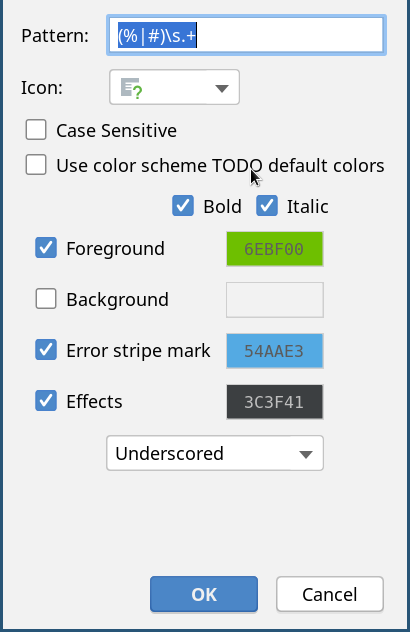
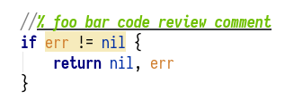
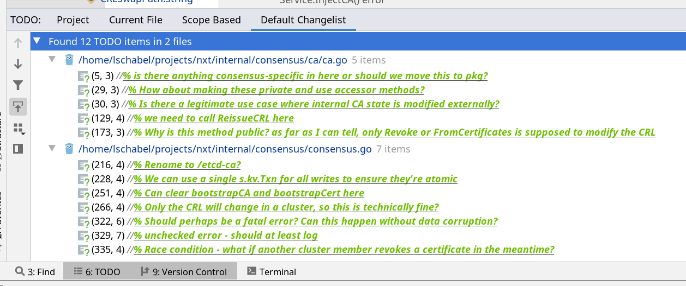

# phab-inlinereview

**Note:** This is no longer maintained, since we no longer use Phabricator. This repository preserves the code in case
anyone else wants to use and maintain it.

---

For large or complex changes, it can be a lot easier to do code review from your IDE, with familiar syntax highlighting
and code intelligence features.

Use `arc patch D123` to check out a revision.

Soft-reset your repo to HEAD^ using `git reset --soft HEAD^`. The changes you want to review are now staged ("*Changes
to be committed*"). The changes will be highlighted and can easily be reviewed inside the IDE. Any modifications to the
repository you make will be *un*staged ("*Changes not staged for commit*").

Once you're done, use the reflog to go back to where you were using `git reset HEAD@{1}`. The unstaged changes you made
on HEAD^ will survive, and you can commit them (in order to create a stacked follow-up revision), and submit
inlinereview comments.

The inlinereview tool can submit draft code review comments added as unstaged changes in your local Git working copy.
You need to use the following comment syntax:

```lang=diff
+//% This is a code review comment. It can include Remarkup:
+//%
+//%   - This is a multi-line list
+//%   - Lorem Ipsum
 consensusCerts, err := s.consensusService.IssueCertificate(req.Host)
 if err != nil {
     nil, err
 }
```

Run the tool once in your working directory, and your comments will visible as unsubmitted drafts in Phabricator. You
can then complete the review in Phabricator and submit it.

### IntelliJ highlighting

You can add a custom style for `%\s.+` in Editor → TODO to get highlighting:






You can then add a TODO filter to see a list of all pending comments:



